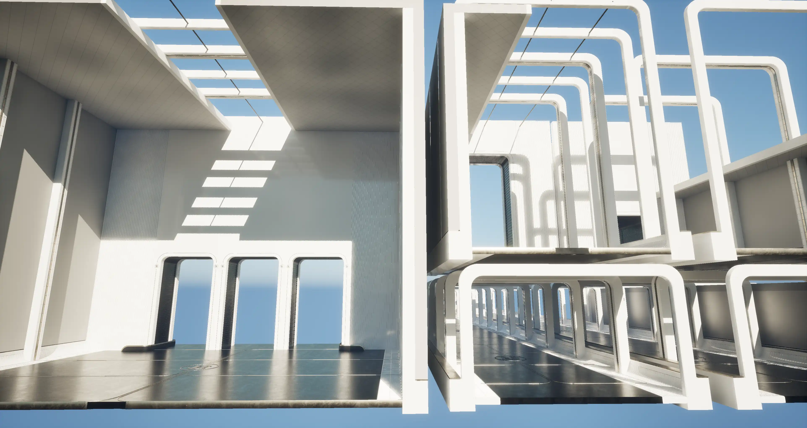

# PCG Demo Room

虚幻引擎(UE5.6) DemoRoom的PCG版本，全流程使用PCG构建 
[中文介绍](./readme_zh.md)

Unreal Engine(UE5.6) DemoRoom PCG Version, Full process use PCG to build.

I found the DemoRoom in UE's official ContentSample, which can generate different room variations. It uses Blueprints to achieve fine control over the rooms.

Fine control is well-suited for Blueprint scripting, but it requires a lot of Blueprint code. The official DemoRoom was created before PCG and is about 10 years old. Now with PCG available, I want to test if PCG can meet this kind of need.

Often, PCG is used as a tool for scattering points randomly on terrain, sampling terrain, models, textures, etc., so it's mostly seen as a **macro-level tool**.

This is an experimental project to explore whether PCG can finely control room generation like UE's official DemoRoom, and whether the development and maintenance costs are lower than using Blueprint scripting. Is it more convenient?

Some of my thoughts:
- **Transform Location**: Floating-point calculations are prone to errors, which can carry over into later calculations, especially if the starting point isn't the origin. To eliminate errors, it's best to use world coordinates (0,0,0) as the starting point and then use Copy Points to move everything to the target location in the final stage.
- **Subdivide Spline**: Its extrusion vector is very picky. If there's even a tiny error in the transform, like the vector being off by 1cm, it'll throw an error (or a warning if it's not fully used). So when setting the extrusion vector length, leave a little extra margin.
- Overall, PCG can handle fine control, but you gotta watch out for these small issues.
- Development efficiency depends on how familiar you are with PCG. PCG has way better debugging tools, like quick data inspection, which Blueprints can't match at all.
- Editor performance: PCG needs more computing resources, while regular Blueprint scripts run faster, but it's usually not a big deal.

From:

To:

## The two ideas:
- Use Grammar to build symmetric patterns, such as house columns, doors, etc.
  

- place the model positions in the level, generate Packed Level Actor, and then generate PCG Assets
- 

## PCG Functions

I have created some PCG functions for this demo, hope it helps you.

