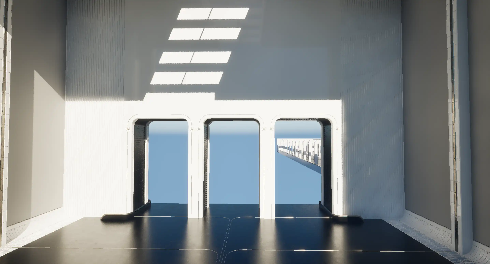
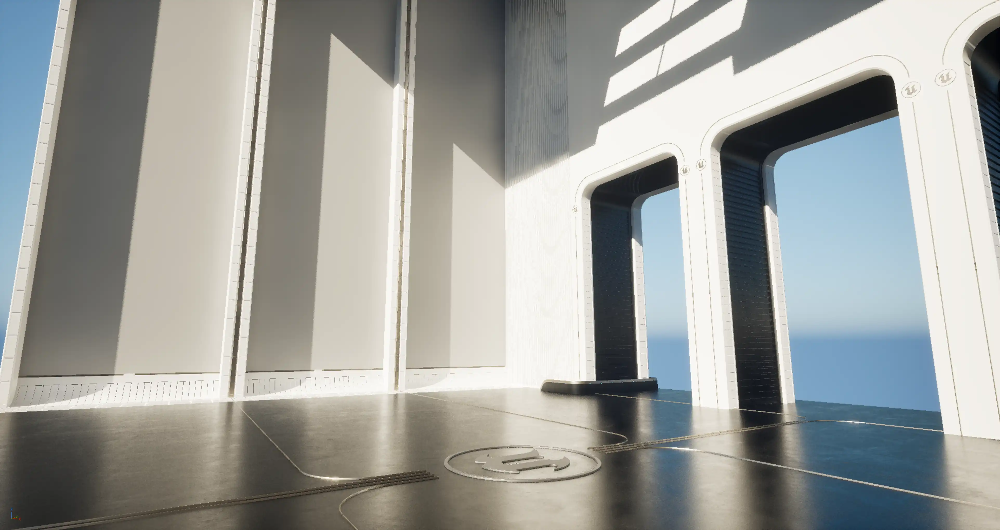

# PCG Demo Room

虚幻引擎 DemoRoom的PCG版本，全流程使用PCG构建

Unreal Engine DemoRoom PCG Version, Full process use PCG to build.

From:

To:

## The two ideas:
- Use Grammar to build symmetric patterns, such as house columns, doors, etc.
  

- place the model positions in the level, generate Packed Level Actor, and then generate PCG Assets
- 

## Pcg Functions

I have created some PCG functions for this demo, hope it helps you.

