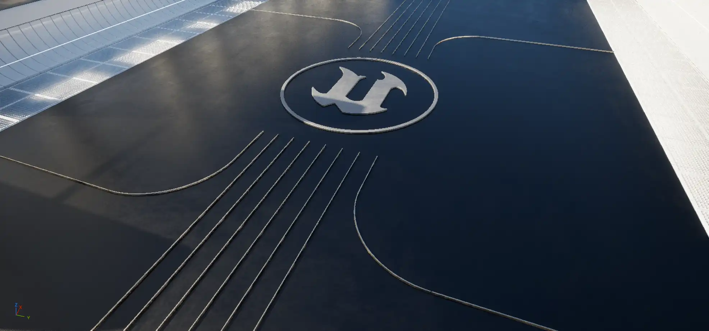
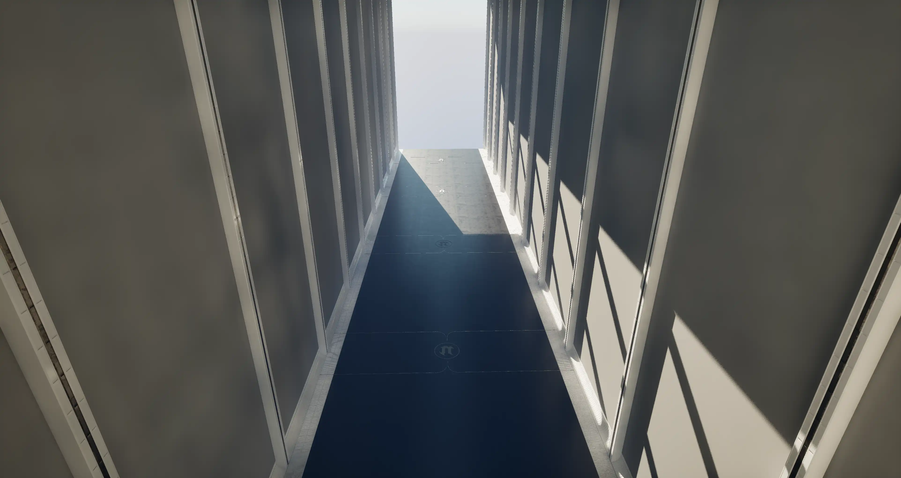
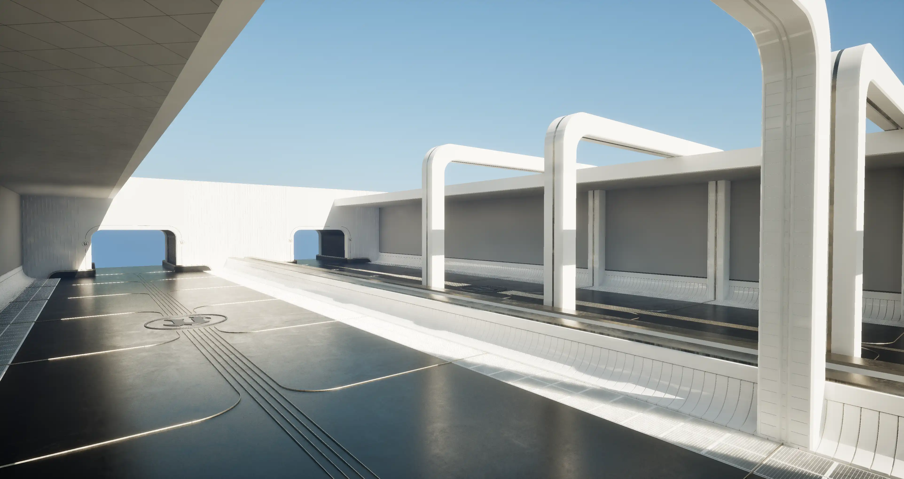

# PCG Demo Room

虚幻引擎(UE5.6) DemoRoom的PCG版本，全流程使用PCG构建

我在UE的官方的ContentSample里面发现了DemoRoom，能够生成不同的房间变体，它是使用Blueprint来实现对房间的精细控制。
精细控制非常适合蓝图脚本来实现，但需要大量的蓝图代码，而官方的DemoRoom是PCG之前的产物，应该差不多有10年的历史了，现在有了PCG，需要验证PCG是否能实现这种需求。

很多时候PCG都被作为随机在地形上撒点的工具，采样地形，采样模型，采样纹理等等，所以PCG多数时候都是作为一种**宏观工具**使用。

所以这是一个实验性项目，探索PCG能否像UE官方的DemoRoom那样，精细地控制房间的生成，开发和维护成本是否比蓝图脚本实现要低？是否更加方便等。

我的一些看法：
- Transform Location： 这些浮点计算非常容易产生误差，误差会传递到后续的计算中，尤其是起始点不是原点的时候。所以为了消灭误差，选择世界坐标0，0，0作为起始点是最好的选择，最后阶段使用Copy Points 将点复制到目标位置即可。
- Subdivide Spline： 它的挤出向量非常挑剔，如果因为transform的误差，导致实际向量长度多了1cm，它就会报错拒绝生成。（超出是报错，没有用完则是警告）所以设置挤出向量的长度的时候要稍微预留更大一些的长度。
- 总的来说，PCG是可以进行精细控制的，但是需要 注意上面这些小问题。
- 开发效率上，取决于开发者对PCG的熟悉程度，PCG有更方便的调试方式，调试数据快速查看，这些蓝图是完全无法替代的。
- Editor的运行速度，PCG需要更多的计算资源，普通的蓝图脚本会快速，但基本上不算问题。

From:

To:

## 主要两种做法:
- 使用Grammar来构建一些相对简单的结构，如柱子，门等。
  

- 在关卡里面摆好模型位置，生成Packed Level Actor, 再生成PCG资产
- 

## PCG Functions

这个项目里还有一些通用的PCG函数，希望能够帮到你。

